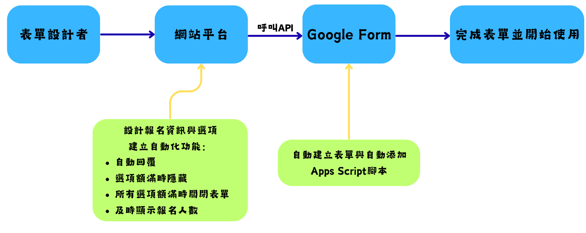

# 📘 Google Form 自動化報名系統網站

## 🧩 專案簡介
本專題旨在開發一個 **Google 表單自動化報名系統網站**，協助使用者在 **不需撰寫程式碼** 的情況下，快速生成具備「自動回信、名額限制、額滿自動關閉」等進階功能的報名系統。

---

## 專案流程圖

---

## 🚀 開發進度

### ✅ 系統規劃階段
- 已確立專題方向為「協助使用者生成智慧報名表單網站」。
- 採用 **Google Forms + Google Apps Script** 技術架構。
- 設計主要流程：
---

### 💻 前端開發階段（進行中）
- 已在 **VS Code** 建立 **React + Vite** 開發環境。
- 網站提供介面讓使用者可自訂：
- 活動名稱  
- 場次名稱與人數上限  
- 自動回信內容  
- 預計整合 **Tailwind CSS** 提升 UI 美觀與一致性。

---

### 🧠 後端功能規劃
- 採用 **Node.js (Express)** 框架作為伺服器。
- 整合：
- Google Forms API → 自動建立表單  
- Google Apps Script API → 控制表單邏輯（名額限制、自動關閉）  
- Gmail API → 寄送自動回信  
- 預期功能：
- 自動建立 Google Form 並設定問題（姓名、Email、場次）
- 自動加入名額限制與額滿隱藏邏輯
- 回傳表單連結給使用者

---

### 🔜 未來開發項目
- 實作：
- 自動寄信功能  
- 名額即時更新顯示  
- 管理者介面（可查看報名名單與場次狀況）  
- 部署網站至雲端（預計使用 **Vercel** 或 **Google Cloud**）

---

## 🧑‍💻 開發環境
- **Node.js v22.20.0 (LTS)**
- **React + Vite**
- **VS Code**
- **Google API / Apps Script**

---

## 📅 專案狀態
目前專案處於 **前端開發階段**，已完成試驗App Script自動回信程式碼，仍進行顯示報名人及額滿時隱藏選項等功能程式碼除錯，後續將進行 API 串接與自動化流程測試。

---

> 💡 專題成員持續優化中，預計完成一個能讓使用者「幾分鐘內自動生成進階 Google 表單」的線上服務！
